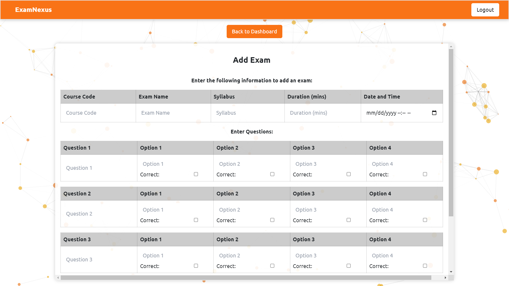
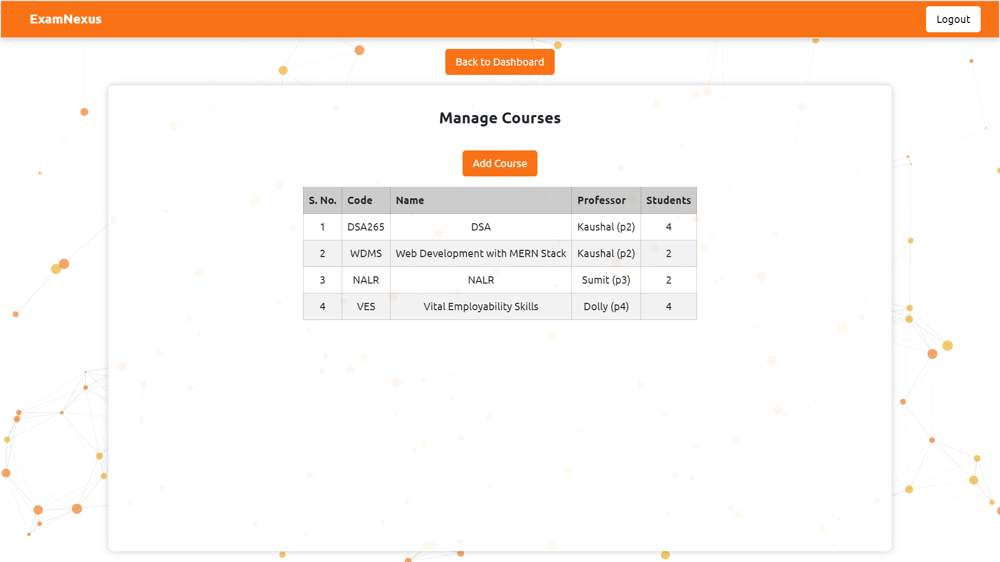
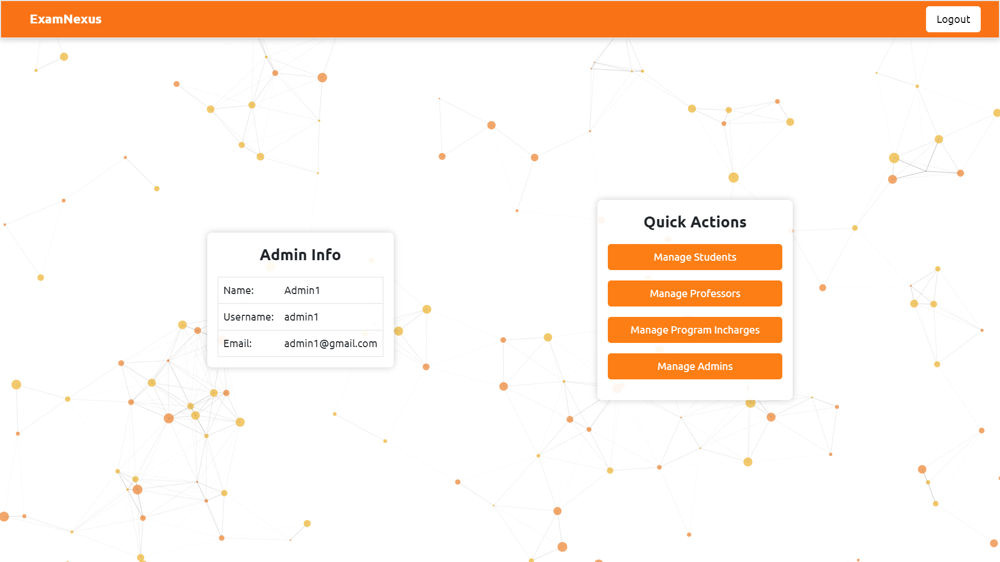

# ExamNexus: Revolutionizing Education Assessment

ExamNexus is a cutting-edge web platform addressing the challenges faced by students and universities in timely result access, result appeal processes, and exam analysis. Designed for Chitkara University and beyond, ExamNexus serves as a central hub, providing real-time exam information, quick result dissemination, and potential future features like notifications and AI-based grading for enhanced educational efficiency. Experience a seamless solution to empower both students and educational institutions.

### Team Name: SuccessSculptors
#### Team Members:
1. Madhav Goyal (2011981262)
2. Pranav Saluja (2111981140)
3. Umesh (2111981206)
4. Siddharth Jaiswal (2111981177)

---
---

## How to Run:

#### Prerequisites:

1. Install MongoDB
2. Create database with the name `exam_nexus_db`

#### Client:

1. Change current working directory to "exam-nexus/client".
2. Install all required modules using: `npm i`
3. Run command: `npm run dev`

#### Server:

1. Change current working directory to "exam-nexus/client".
2. Run command: `npm run devStart`
3. Install all required modules using: `npm i`

---
---

## Technologies Used:

1. Front-End: React, BootStrap, TailwindCSS, SCSS
2. Back-End: NodeJS, ExpressJS
3. Database: MongoDB, Mongoose

---
---

## Main Features:

#### 4 Types of Users:

##### Students: 
Students can view exam schedule, attend exams, and view results

---

##### Professors:
Professors can manage exams for their respected courses

---

##### Program-Incharges:
Program Incharges can manage courses, assign professors to courses and add students to courses

---

##### Admins:
Admins can manage students, professors, program-inchages, and admins by adding, updating or removing them

---
---

### Website Overview:

#### Login Page:

---

#### Student Dashboard
###### Student Info, Quick Actions, Exam Schedule Calendar:

---

#### Professor Dashboard and Exam Schedule Calendar:
###### Professor Info, Quick Actions, Exam Schedule Calendar:

###### Add Exam:

---

#### Program Incharge Dashboard:

###### View Courses:

###### Add Course:

---

#### Admin Dashboard:

###### Manage Students:

###### Manage Professors:

###### Manage Program Incharges:

###### Manage Admins:

---

